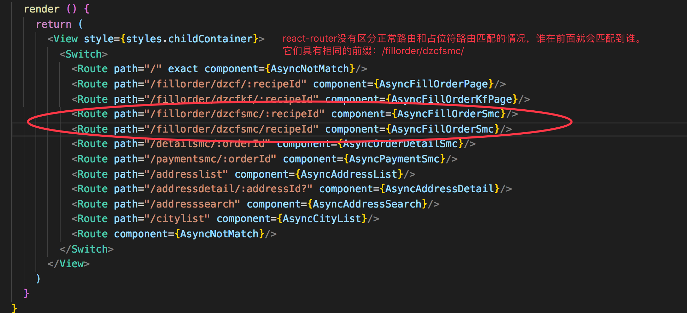

# [babel(6.26.0)](https://segmentfault.com/a/1190000008159877)
* babel：仅仅用于语法转换(transforms syntax)，无法使用Promise等浏览器未实现的全局对象(globals,native methods)
* babel-pollyfill（babel-runtime）：使用Promise等浏览器未实现的全局对象(globals,native methods)
* babel-plugin-transform-runtime：配合babel-runtime使用，功能类似babel-pollyfill
* babel-preset-react：转换JSX语法
* babel-preset-env：使用babel-preset-env, 我们可以声明环境, 然后该preset就会只编译包含我们所声明环境缺少的特性的代码，因此也是比较推荐的方式。当没有添加任何的配置选项时，babel-preset-env默认行为是和babel-preset-latest是一样的

`注：`最新的babel更加组件化，需要自行配置plugins实现所需要的功能，plugin是具有单一功能的模块，而preset是一组plugins，如：es2015-classes，es2015-for-of等等以及babel-preset-2015

[babel参考链接](https://segmentfault.com/a/1190000008159877)
# react(16.2.0)

# react-router(4.2.0)
* location：指定当前App的位置
* match：包含params，path，url，isExact四个属性，如图所示:

* 路由前缀重合，造成的匹配问题，如下图所示：

# mobx(4.1.0)

# webpack(4.1.1)

# http
* client------>server1------>server2------>...------>origin server(这个才是提供资源的那个web server)，所以即使origin server服务器没有启动，你的http请求也会得到相应的5XX响应。
* 关于xmlhttprequest状态码以及业务代码如何设计方案？目的：前端更好的处理异常场景，在UI展示或前端交互提供更好的用户体验，比如：通信未接通，直接提示用户网络故障（用户未联网或者服务器挂掉了，这个需要委婉的提示）等等。
* 1、统一使用http状态码
* 2、统一自定义状态码
* 3、混合使用http状态码+自定义状态码